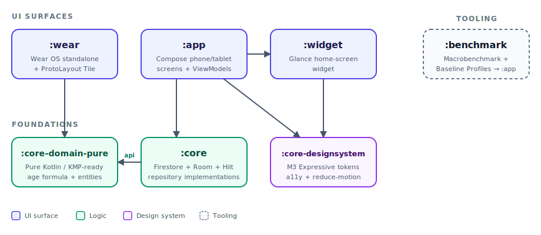
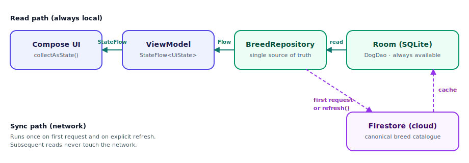

# Calculadora Perruna

[](https://github.com/AlvaroQ/CalculadoraPerruna/actions/workflows/ci.yml)
[](https://play.google.com/store/apps/details?id=com.alvaroquintana.edadperruna)


[](LICENSE)

<p align="center">
  
</p>

---

## Table of Contents

[About](#about) · [Features](#features) · [Tech Stack](#tech-stack) · [Architecture](#architecture) · [Design Decisions](#design-decisions) · [Testing](#testing) · [Performance](#performance) · [Getting Started](#getting-started) · [Links](#links) · [License](#license)

---

## About

Calculadora Perruna is an Android utility that **translates between dog years and human years** using a logarithmic conversion model — bidirectional: dog → human, or human → dog years for the selected breed. Result is shown numerically and as a life-trajectory chart.

It also ships a breed catalogue enriched with FCI classification, physical characteristics, life expectancy, character, common diseases, hygiene and nutrition — sourced from Firestore and cached locally for offline use.

Built with modern Kotlin, Jetpack Compose, Hilt and Clean Architecture across **seven Gradle modules** (`:app`, `:core`, `:core-domain-pure`, `:core-designsystem`, `:widget`, `:wear`, `:benchmark`). Doubles as a real-world reference for migrating an Android app from Fragments + Koin + XML to Compose + Hilt + Clean Architecture without rewriting from scratch (see [PR #1](https://github.com/AlvaroQ/CalculadoraPerruna/pull/1)).

### Modern Android 2026 — form factors, APIs, accessibility

This project is also a showcase of **APIs 2025-2026 that most Android apps haven't adopted yet**, intentionally selected to demonstrate form-factor awareness, official Google tooling, and accessibility as a first-class concern:

| Signal                                  | Where it lives                                       | Why it matters                                                 |
| --------------------------------------- | ---------------------------------------------------- | -------------------------------------------------------------- |
| **Glance Widget** (Compose for widgets) | `:widget` module                                     | Same design tokens as `:app` — zero XML duplication.           |
| **Wear OS standalone**                  | `:wear` module                                       | Picker + result on `ScalingLazyColumn`, Material 3 Wear 1.6.1. |
| **Wear OS Tile (ProtoLayout)**          | `:wear/tile/PerrunoTileService.kt`                   | Declarative tile rendered by SysUI, taps launch the calculator. |
| **Wear ↔ phone sync**                   | `:app/wearsync` + `:wear/sync`                       | `Wearable.DataClient` channel at `/favorite_breed`.            |
| **Predictive Back gesture**             | `ResultScreen.kt` + `AndroidManifest.xml`            | Hero atenuates in sync with the swipe `progress`.              |
| **Material 3 Expressive motion**        | `:core-designsystem/theme/PerrunoTokens.kt`          | Hero number reveal with overshooting spring.                   |
| **Baseline Profiles + Macrobenchmark**  | `:benchmark` module + `.github/workflows/macrobenchmark.yml` | Real profile shipped (37k entries); CI workflow re-measures cold start on every push to master. |
| **Compose Preview Screenshot Testing**  | `:app/src/screenshotTest/`                           | Official Google plugin, alpha14 — 13 snapshot baselines.       |
| **Semantics + LiveRegion TalkBack**     | `ResultScreen.kt`, `HomeScreen.kt`, `SettingsScreen.kt` | Result announced automatically on reveal.                   |
| **Dynamic type `fontScale=2.0`**        | `app/src/screenshotTest/DynamicTypePreviews.kt`      | WCAG 2.2 AA — 200% text scaling without overflow.              |
| **Reduce-motion aware animations**      | `:core-designsystem/a11y/ReducedMotion.kt`           | Springs snap to target when `ANIMATOR_DURATION_SCALE=0`.       |
| **Architecture tests (Konsist)**        | `app/src/test/.../ArchitectureTest.kt`               | ViewModels, domain purity and use-case placement enforced.     |
| **Code coverage (Kover)**               | `:app` + `:core` + `:core-domain-pure` aggregated    | 94.96% line coverage with per-package and project-wide thresholds enforced via `koverVerify`. |

See the [ADRs in `docs/adr/`](docs/adr/README.md) for the technical reasoning behind each of these adoptions.

### Hilt — what's interesting beyond "we use it"

Most Android projects pick a DI framework and stop there. The decisions worth highlighting here are the *non-obvious* ones — what happens at the boundaries:

| Decision                                   | Where                                                              | Why it's non-obvious                                                                            |
| ------------------------------------------ | ------------------------------------------------------------------ | ----------------------------------------------------------------------------------------------- |
| Firebase singletons wrapped in modules     | [`:core/di/FirebaseModule.kt`](core/src/main/java/com/alvaroquintana/edadperruna/core/di/FirebaseModule.kt), [`:app/di/FirebaseAnalyticsModule.kt`](app/src/main/java/com/alvaroquintana/edadperruna/di/FirebaseAnalyticsModule.kt) | Zero `FirebaseX.getInstance()` calls leak into application code. `FirestoreBreedDataSource`, `AnalyticsManager` and `CalculadoraApp` are all constructor-injectable → tests need no `mockkStatic` ceremony. |
| `:wear` and `:widget` opt out of Hilt      | [`:wear/build.gradle.kts`](wear/build.gradle.kts), [`:widget/`](widget/)                                            | Stateless/standalone surfaces don't pay the cold-start cost of building a DI graph. Wear depends only on `:core-domain-pure` (pure Kotlin, zero Android), Widget is a Glance receiver with no graph at all. Most projects either Hilt everything or struggle to keep these clean. |
| 75 unit tests, zero `@HiltAndroidTest`     | [`app/src/test/`](app/src/test/), [`core/src/test/`](core/src/test/)                                                | Constructor injection makes Hilt a *contract*, not a test-time dependency. ViewModels and data sources are instantiated directly with `mockk()` in plain JUnit 4 — no `HiltTestApplication`, no `HiltAndroidRule`, no instrumentation runner. |
| Pure-domain module excluded from DI        | [`:core-domain-pure`](core-domain-pure/)                                                | The age formula and entities have zero Hilt or Android annotations. Hilt wiring lives in `:core` and `api`-exports the domain types. This keeps the calculation logic reusable across `:wear`, future KMP ports and unit tests with no Android Runtime. |
| Custom `@ApplicationId` qualifier          | [`:core/.../ApplicationId.kt`](core/src/main/java/com/alvaroquintana/edadperruna/core/data/repository/ApplicationId.kt) | Package name is bound via a custom qualifier and injected into `AnalyticsManager` instead of being hardcoded or pulled from `BuildConfig` at the call site. Small pattern, removes magic strings from singletons. |

KSP (not KAPT), `@Binds` for interfaces, `@Provides` for framework singletons, `SingletonComponent` everywhere — no scope sprawl, no `@AssistedInject` complexity, just the boring patterns done correctly.

---

## Features

- **Bidirectional age calculator** — convert dog age (years + months) to human equivalent using the formula `16 · ln(years) + 31`, or compute the inverse for human-to-dog translation. Includes special handling for the first year of life where the linear model breaks down.
- **Visual life trajectory chart** — Vico-rendered curve from 0 to 22 dog years with a marker at the user's input.
- **Breed catalogue** — searchable grid of dog breeds with image previews, sourced from Firestore and cached in Room. Tap for full breed detail (FCI group, weight/height ranges per sex, character, life expectancy, common diseases, nutrition, hygiene, hair loss).
- **Offline-first** — Firestore syncs once into Room; subsequent breed queries hit SQLite. Network status is observed with `ConnectivityObserver` and surfaces a non-blocking dialog when the device goes offline.
- **Adaptive theming** — Material 3 light/dark/system themes user-selectable from settings, persisted with DataStore.
- **Monetization** — AdMob banner, interstitial and rewarded units integrated with a screen-view counter to keep frequency reasonable.

---

## Tech Stack

| Category               | Technology                                                  | Version           |
| ---------------------- | ----------------------------------------------------------- | ----------------- |
| Language               | Kotlin                                                      | 2.3.20            |
| Build                  | Android Gradle Plugin                                       | 9.1.1             |
| UI                     | Jetpack Compose + Material 3                                | BOM 2026.03.01    |
| Architecture           | Clean Architecture — 7 Gradle modules                       | MVVM              |
| State Management       | StateFlow + Channel events                                  | Coroutines 1.10.2 |
| Navigation             | Navigation Compose                                          | 2.9.7             |
| Dependency Injection   | Hilt                                                        | 2.59.2            |
| Local Persistence      | Room (KSP) + DataStore Preferences                          | 2.8.4 / 1.2.1     |
| Backend                | Firebase (Firestore, Realtime DB, Auth, Analytics, Crashlytics) | BOM 34.12.0  |
| Images                 | Coil Compose                                                | 2.7.0             |
| Charts                 | Vico Compose M3                                             | 3.1.0             |
| Serialization          | kotlinx.serialization                                       | 1.11.0            |
| Monetization           | AdMob (banner + rewarded + interstitial)                    | 25.2.0            |
| Min SDK                | Android 6.0 (Marshmallow)                                   | API 23            |
| Compile / Target SDK   | Android 15                                                  | API 36            |

---

## Architecture

Seven Gradle modules grouped by role: three UI surfaces (phone, watch, widget), three foundations (data, pure logic, design system) and one tooling module (benchmark).

<p align="center">
  
</p>

- **`:app`** — Compose phone/tablet UI: screens (`HomeScreen`, `BreedListScreen`, `BreedDescriptionScreen`, `ResultScreen`, `SettingsScreen`), ViewModels, navigation, AdMob and analytics.
- **`:wear`** — Wear OS standalone app + ProtoLayout Tile, depends only on `:core-domain-pure` so the calculation logic is shared without dragging Firestore or AdMob onto the watch.
- **`:widget`** — Glance home-screen widget; reuses `:core-designsystem` so widget and app share tokens with zero XML duplication.
- **`:core`** — Data layer: Room (`AppDatabase`, `DogDao`, mappers), Firestore data source, DataStore, `ConnectivityObserver`, repository implementations and Hilt modules. Re-exports `:core-domain-pure` via `api` so `:app` sees the domain types transitively.
- **`:core-domain-pure`** — Pure Kotlin / KMP-ready: `Dog`, `FCI`, `Weight`, `Height`, `MainInformation`, `PhysicalCharacteristics`, `Prize`, `LifeExpectancy`, `App` and the age conversion formula. Zero Android dependencies.
- **`:core-designsystem`** — `PerrunoTokens`, Material 3 Expressive theming, accessibility helpers and the `ReducedMotion` API consumed by both `:app` and `:widget`.
- **`:benchmark`** — `com.android.test` module that runs Macrobenchmark and generates Baseline Profiles for `:app`.

ViewModels expose `StateFlow<UiState<T>>` for reactive screen state and a `Channel`-backed `Flow<Event>` for one-shot events (navigation, dialogs, errors). Hilt wires repositories, data sources, Firebase singletons and the database at the `SingletonComponent` level.

---

## Design Decisions

Short rationale behind the less-obvious architectural choices — what was gained, what was given up.

- **No separate `usecases` + `data` + `domain` modules.** The classic Clean Architecture split (`app` / `usecases` / `data` / `domain`) was the previous shape — see [PR #1](https://github.com/AlvaroQ/CalculadoraPerruna/pull/1) for the migration. With one calculator screen and one CRUD-style breed feature, the use-case layer was a thin pass-through and the separate `data` interface module added coupling without leverage. The current layering is `:app` ↔ `:core` ↔ `:core-domain-pure` — three Clean Architecture layers, not four — which removed ~30 boilerplate files. The other modules (`:widget`, `:wear`, `:core-designsystem`, `:benchmark`) exist for form factors and tooling, not Clean Architecture layering. *Tradeoff:* if a third feature with non-trivial business logic shows up, a dedicated `usecases` module becomes worth re-introducing.
- **Hilt over Koin.** Compile-time validation catches missing bindings before runtime, KSP keeps incremental builds fast, and the integration with `@HiltViewModel` + `hilt-navigation-compose` is first-class. *Tradeoff:* annotation processing adds time on cold builds, and DI graph errors are noisier than Koin's lambda DSL.
- **Firestore as source of truth, Room as offline cache.** Breed data is fetched once into Room on first request, then served from SQLite forever after. Random catalog browsing and breed lookups don't burn Firestore reads; the app stays fully usable without network. *Tradeoff:* new content from Firestore isn't pushed in real time — users get it on next refresh. Acceptable for a dataset that changes on the order of weeks. `BreedRepository.refreshBreeds()` is exposed for explicit re-sync.

  <p align="center">
    
  </p>

- **Inject Firebase singletons via Hilt instead of `getInstance()`.** `FirestoreBreedDataSource` originally pulled `FirebaseFirestore.getInstance()` and `FirebaseCrashlytics.getInstance()` from inside its methods, which made it untestable without `mockkStatic` ceremony. A dedicated `FirebaseModule` now provides them as `@Singleton` bindings — see [PR #5](https://github.com/AlvaroQ/CalculadoraPerruna/pull/5) for the original refactor and [PR #48](https://github.com/AlvaroQ/CalculadoraPerruna/pull/48) for extending the pattern to `FirebaseAuth` and `FirebaseAnalytics` (the last `getInstance()` calls in `AnalyticsManager` and `CalculadoraApp`). *Tradeoff:* two DI modules to maintain (`FirebaseModule` in `:core` for Firestore/Auth/Crashlytics, `FirebaseAnalyticsModule` in `:app` so `:core` doesn't need to drag in `firebase-analytics`). Tests dropped from a hypothetical 200+ lines of static mocking to 80 lines of straight constructor injection.
- **`kotlinx-coroutines-play-services` `.await()` over hand-rolled `suspendCancellableCoroutine`.** The previous data source wrapped each Firestore `Task<T>` in a manual `suspendCancellableCoroutine` block (~25 lines per call). Replaced with the `.await()` extension (3 lines), with try/catch preserving the exact same failure semantics. *Tradeoff:* none — the new code is shorter, more idiomatic, and exceptions propagate as expected.
- **DataStore Preferences over SharedPreferences.** Async-by-default Flow API integrates cleanly with `StateFlow.stateIn(...)` in the ViewModel. *Tradeoff:* DataStore writes are not transactional with other state — fine here because preferences are independent.
- **MVVM over MVI.** ViewModels expose granular `StateFlow`s per concern (`uiState`, `showAd`, `showNoInternet`) plus a `Channel`-backed `Flow` for one-shot events, instead of a single `UiState` reduced from `Intent`s. The screens here have a handful of orthogonal fields and no need for time-travel debugging, so MVI's reducer ceremony would be pure overhead. *Tradeoff:* no single snapshot of "the screen right now" — acceptable because state coherence is local to each ViewModel.

---

## Testing

All tests run on the JVM — no device, no emulator. Every push and pull request to `master` runs the full suite through [GitHub Actions](.github/workflows/ci.yml) and the `Unit tests` check is a required gate on `master`'s branch protection.

| Module   | Tests | What's covered                                                                                                          |
| -------- | ----: | ----------------------------------------------------------------------------------------------------------------------- |
| `app`    |    53 | ViewModels (`HomeViewModel`, `BreedListViewModel`, `BreedDescriptionViewModel`, `ResultViewModel`, `SettingsViewModel`) + `AdManager` |
| `core`   |    22 | `DogEntityMapper` (round-trip JSON encoding), `FirestoreBreedDataSource`, `BreedRepositoryImpl`, `PreferencesRepositoryImpl` |
| **Total** | **75** | **0 failures · 0 flaky · 0 skipped**                                                                                   |

Stack:

- **JUnit 4** for the test harness
- **MockK** for mocking suspending APIs and Firebase boundaries
- **Turbine** for asserting `StateFlow` and `Channel` emissions
- **kotlinx-coroutines-test** for `runTest` and `TestDispatcher`
- **`Tasks.forResult` / `Tasks.forException`** from Play Services for synchronous Firestore Task simulation — no static mocking required

Run the full suite locally:

```bash
./gradlew test
```

Run a single module:

```bash
./gradlew :core:test
./gradlew :app:test
```

### Screenshot testing (Compose Preview)

UI regressions are guarded by [Compose Preview Screenshot Testing](https://developer.android.com/studio/preview/compose-screenshot-testing) — the official Google plugin that turns `@Preview` functions into snapshot tests. Baseline snapshots cover `PerrunoButton`, `PerrunoCard`, `InfoChip` and dynamic-type previews (`fontScale=2.0`).

```bash
./gradlew :app:validateDebugScreenshotTest   # CI check
./gradlew :app:updateDebugScreenshotTest     # regenerate references after intentional changes
```

HTML report: `app/build/reports/screenshotTest/preview/debug/index.html`.

---

## Performance

Startup time is measured with **Jetpack Macrobenchmark** and optimized with **Baseline Profiles** (both AOT-compiled via ART on first install). Infrastructure lives in the `:benchmark` module (`com.android.test`).

**Requires a connected device or emulator** (API 28+). The JVM-only unit tests from `./gradlew test` do *not* cover these.

```bash
# Regenerate the baseline profile (writes app/src/release/generated/baselineProfiles/baseline-prof.txt)
./gradlew :app:generateReleaseBaselineProfile

# Measure cold startup with and without the baseline profile applied
./gradlew :benchmark:connectedBenchmarkReleaseAndroidTest
```

The committed profile is regenerated on demand — CI runs the same measurement automatically on every push to `master` via [`.github/workflows/macrobenchmark.yml`](.github/workflows/macrobenchmark.yml) and uploads timing artifacts (14d retention).

Reports land in `benchmark/build/outputs/connected_android_test_additional_output/`. Expected signal: Baseline Profile run is 15-25% faster than `CompilationMode.None` on cold start.

---

## Getting Started

### Prerequisites

- **JDK 17+** (required by Android Gradle Plugin 9.x)
- **Android Studio Ladybug (2024.2)** or newer
- **Android SDK 36** installed via SDK Manager
- A Firebase project with `google-services.json` (Firestore, Realtime Database, Auth, Analytics and Crashlytics enabled)
- An AdMob account for ad unit IDs (test IDs work out of the box for debug builds)

### Setup

1. Clone the repository:

   ```bash
   git clone https://github.com/AlvaroQ/CalculadoraPerruna.git
   ```

2. Drop your `google-services.json` in `app/`.

3. Create `app/src/main/res/values/secrets.xml` with your AdMob keys:

   ```xml
   <?xml version="1.0" encoding="utf-8"?>
   <resources>
       <string name="admob_id">ca-app-pub-XXXXXXXXXXXXXXXX~XXXXXXXXXX</string>
       <string name="admob_banner_main_id">ca-app-pub-XXXXXXXXXXXXXXXX/XXXXXXXXXX</string>
       <string name="admob_banner_list_id">ca-app-pub-XXXXXXXXXXXXXXXX/XXXXXXXXXX</string>
       <string name="admob_banner_settings_id">ca-app-pub-XXXXXXXXXXXXXXXX/XXXXXXXXXX</string>
       <string name="admob_banner_description_id">ca-app-pub-XXXXXXXXXXXXXXXX/XXXXXXXXXX</string>
       <string name="admob_intersticial_result_id">ca-app-pub-XXXXXXXXXXXXXXXX/XXXXXXXXXX</string>
       <string name="admob_bonificado_list_id">ca-app-pub-XXXXXXXXXXXXXXXX/XXXXXXXXXX</string>
       <string name="admob_banner_test_id">ca-app-pub-XXXXXXXXXXXXXXXX/XXXXXXXXXX</string>
       <string name="admob_intersticial_list_id">ca-app-pub-XXXXXXXXXXXXXXXX/XXXXXXXXXX</string>
       <string name="admob_bonificado_test_id">ca-app-pub-XXXXXXXXXXXXXXXX/XXXXXXXXXX</string>
   </resources>
   ```

   For a first build, Google publishes a set of always-on [AdMob test ad unit IDs](https://developers.google.com/admob/android/test-ads) that you can drop into the `*_test_id` entries. Replace them with your own production IDs before shipping a release build.

4. Build the debug APK:

   ```bash
   ./gradlew assembleDebug
   ```

5. (Optional) Run the unit tests:

   ```bash
   ./gradlew test
   ```

### Contributing

The project follows **GitHub Flow** with a protected `master` branch:

- All changes go via pull request — direct pushes to `master` are blocked.
- The `Unit tests` CI check is required to pass before any merge.
- Linear history is enforced (squash merge only).
- Conventional commit prefixes: `feat:`, `fix:`, `refactor:`, `chore:`, `test:`, `docs:`.

---

## Links

- [Play Store listing](https://play.google.com/store/apps/details?id=com.alvaroquintana.edadperruna) — install Calculadora Perruna on your device
- [Promo video](https://youtu.be/0nIL4seuEfQ) — short overview of the app
- [Report a bug](https://github.com/AlvaroQ/CalculadoraPerruna/issues/new?labels=bug) — something broken or unexpected
- [Request a feature](https://github.com/AlvaroQ/CalculadoraPerruna/issues/new?labels=enhancement) — propose an improvement
- [CI workflows](https://github.com/AlvaroQ/CalculadoraPerruna/actions) — latest build and test runs

---

## License

Released under the [Apache License 2.0](LICENSE). You are free to use, modify, and distribute the code with attribution.
