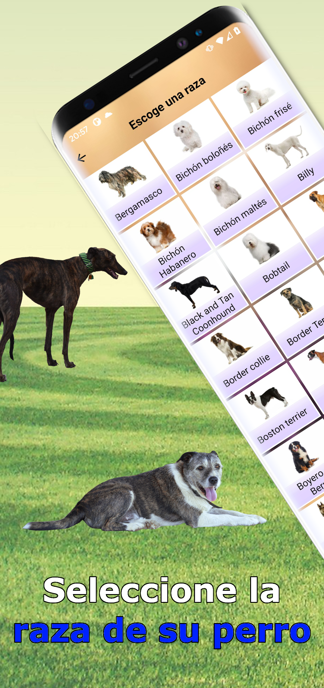
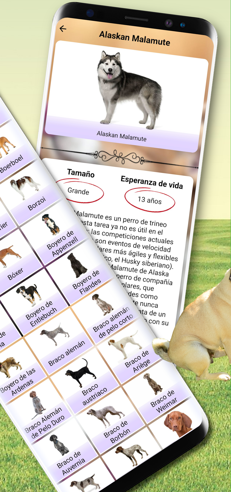
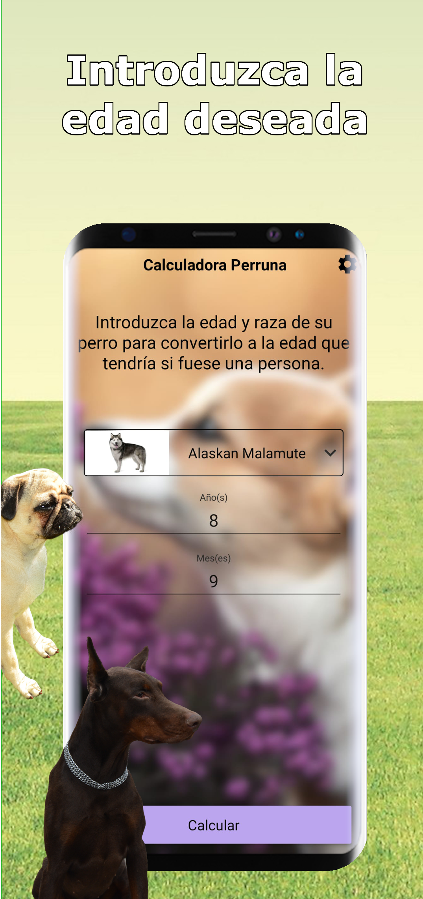

# Calculadora Perruna

[](https://github.com/AlvaroQ/CalculadoraPerruna/actions/workflows/ci.yml)
[](https://play.google.com/store/apps/details?id=com.alvaroquintana.edadperruna)


[](LICENSE)

---

## Table of Contents

[About](#about) · [Screenshots](#screenshots) · [Features](#features) · [Tech Stack](#tech-stack) · [Architecture](#architecture) · [Design Decisions](#design-decisions) · [Testing](#testing) · [Getting Started](#getting-started) · [Links](#links) · [License](#license)

---

## About

Calculadora Perruna is an Android utility app that **translates between dog years and human years** using a logarithmic age conversion model — bidirectional: enter your dog's age and breed to see what age that would be in human years, or enter your own age to see what age you'd be if you were a dog of the selected breed. The result is shown numerically and as a chart of life trajectory.

The app ships with a catalogue of dog breeds enriched with FCI classification, physical characteristics, life expectancy, character traits, common diseases, hygiene and nutrition guidance — all sourced from Firestore and cached locally for offline use.

Built with modern Kotlin, Jetpack Compose, Hilt and Clean Architecture across two Gradle modules. Doubles as a real-world reference for migrating an Android app from the Fragments + Koin + XML era to Compose + Hilt + Clean Architecture without rewriting from scratch (see [PR #1](https://github.com/AlvaroQ/CalculadoraPerruna/pull/1) for the full migration).

---

## Screenshots

<table align="center">
  <tr>
    <td align="center"><br/><sub>Calculator home</sub></td>
    <td align="center"><br/><sub>Breed catalogue</sub></td>
    <td align="center"><br/><sub>Result with chart</sub></td>
    <td align="center"><br/><sub>Breed detail</sub></td>
  </tr>
</table>

---

## Features

- **Bidirectional age calculator** — convert dog age (years + months) to human equivalent using the formula `16 · ln(years) + 31`, or compute the inverse for human-to-dog translation. Includes special handling for the first year of life where the linear model breaks down.
- **Visual life trajectory chart** — Vico-rendered curve from 0 to 22 dog years with a marker at the user's input.
- **Breed catalogue** — searchable grid of dog breeds with image previews, sourced from Firestore and cached in Room. Tap for full breed detail (FCI group, weight/height ranges per sex, character, life expectancy, common diseases, nutrition, hygiene, hair loss).
- **Offline-first** — Firestore syncs once into Room; subsequent breed queries hit SQLite. Network status is observed with `ConnectivityObserver` and surfaces a non-blocking dialog when the device goes offline.
- **Adaptive theming** — Material 3 light/dark/system themes user-selectable from settings, persisted with DataStore.
- **Monetization** — AdMob banner, interstitial and rewarded units integrated with a screen-view counter to keep frequency reasonable.

---

## Tech Stack

| Category               | Technology                                                  | Version           |
| ---------------------- | ----------------------------------------------------------- | ----------------- |
| Language               | Kotlin                                                      | 2.3.20            |
| Build                  | Android Gradle Plugin                                       | 9.1.1             |
| UI                     | Jetpack Compose + Material 3                                | BOM 2026.03.01    |
| Architecture           | Clean Architecture — 2 Gradle modules                       | MVVM              |
| State Management       | StateFlow + Channel events                                  | Coroutines 1.10.2 |
| Navigation             | Navigation Compose                                          | 2.9.7             |
| Dependency Injection   | Hilt                                                        | 2.59.2            |
| Local Persistence      | Room (KSP) + DataStore Preferences                          | 2.8.4 / 1.2.1     |
| Backend                | Firebase (Firestore, Realtime DB, Auth, Analytics, Crashlytics) | BOM 34.12.0  |
| Images                 | Coil Compose                                                | 2.7.0             |
| Charts                 | Vico Compose M3                                             | 3.1.0             |
| Serialization          | kotlinx.serialization                                       | 1.11.0            |
| Monetization           | AdMob (banner + rewarded + interstitial)                    | 25.2.0            |
| Min SDK                | Android 6.0 (Marshmallow)                                   | API 23            |
| Compile / Target SDK   | Android 15                                                  | API 36            |

---

## Architecture

Two Gradle modules, one responsibility each:

- **`app`** — Android UI layer: Compose screens (`HomeScreen`, `BreedListScreen`, `BreedDescriptionScreen`, `ResultScreen`, `SettingsScreen`), ViewModels, navigation, AdMob integration and analytics. Depends on `core` for data and domain.
- **`core`** — All non-UI logic: domain entities (`Dog`, `FCI`, `Weight`, `Height`, `MainInformation`, `PhysicalCharacteristics`, `Prize`, `LifeExpectancy`, `App`), repository contracts (`BreedRepository`, `PreferencesRepository`), Room persistence, Firestore data source, DataStore preferences, and Hilt modules. Zero Compose, zero AdMob.

Inside `core` the data layer follows the standard Clean Architecture split:

```
core/
├── domain/
│   ├── model/        — pure entities, @Serializable
│   └── repository/   — contracts (interfaces)
└── data/
    ├── local/        — Room: AppDatabase, DogDao, DogEntity + mapper, PreferencesDataSource
    ├── remote/       — Firestore: FirestoreBreedDataSource
    ├── network/      — ConnectivityObserver
    └── repository/   — implementations of domain contracts
```

ViewModels expose `StateFlow<UiState<T>>` for reactive screen state and a `Channel`-backed `Flow<Event>` for one-shot events (navigation, dialogs, errors). Hilt wires repositories, data sources, Firebase singletons and the database at the `SingletonComponent` level.

---

## Design Decisions

Short rationale behind the less-obvious architectural choices — what was gained, what was given up.

- **Two modules instead of four.** The classic Clean Architecture split (`app` / `usecases` / `data` / `domain`) was the previous shape — see [PR #1](https://github.com/AlvaroQ/CalculadoraPerruna/pull/1) for the migration. With one calculator screen and one CRUD-style breed feature, the use-case layer was a thin pass-through and the separate `data` interface module added coupling without leverage. Collapsing to `app` + `core` cuts the module count in half and removes ~30 boilerplate files. *Tradeoff:* if a third feature with non-trivial business logic shows up, a dedicated `usecases` module becomes worth re-introducing.
- **Hilt over Koin.** Compile-time validation catches missing bindings before runtime, KSP keeps incremental builds fast, and the integration with `@HiltViewModel` + `hilt-navigation-compose` is first-class. *Tradeoff:* annotation processing adds time on cold builds, and DI graph errors are noisier than Koin's lambda DSL.
- **Firestore as source of truth, Room as offline cache.** Breed data is fetched once into Room on first request, then served from SQLite forever after. Random catalog browsing and breed lookups don't burn Firestore reads; the app stays fully usable without network. *Tradeoff:* new content from Firestore isn't pushed in real time — users get it on next refresh. Acceptable for a dataset that changes on the order of weeks. `BreedRepository.refreshBreeds()` is exposed for explicit re-sync.
- **Inject Firebase singletons via Hilt instead of `getInstance()`.** `FirestoreBreedDataSource` originally pulled `FirebaseFirestore.getInstance()` and `FirebaseCrashlytics.getInstance()` from inside its methods, which made it untestable without `mockkStatic` ceremony. A dedicated `FirebaseModule` now provides them as `@Singleton` bindings — see [PR #5](https://github.com/AlvaroQ/CalculadoraPerruna/pull/5) for the refactor. *Tradeoff:* one extra DI module to maintain (~20 lines). Tests dropped from a hypothetical 200+ lines of static mocking to 80 lines of straight constructor injection.
- **`kotlinx-coroutines-play-services` `.await()` over hand-rolled `suspendCancellableCoroutine`.** The previous data source wrapped each Firestore `Task<T>` in a manual `suspendCancellableCoroutine` block (~25 lines per call). Replaced with the `.await()` extension (3 lines), with try/catch preserving the exact same failure semantics. *Tradeoff:* none — the new code is shorter, more idiomatic, and exceptions propagate as expected.
- **DataStore Preferences over SharedPreferences.** Async-by-default Flow API integrates cleanly with `StateFlow.stateIn(...)` in the ViewModel. *Tradeoff:* DataStore writes are not transactional with other state — fine here because preferences are independent.
- **MVVM over MVI.** ViewModels expose granular `StateFlow`s per concern (`uiState`, `showAd`, `showNoInternet`) plus a `Channel`-backed `Flow` for one-shot events, instead of a single `UiState` reduced from `Intent`s. The screens here have a handful of orthogonal fields and no need for time-travel debugging, so MVI's reducer ceremony would be pure overhead. *Tradeoff:* no single snapshot of "the screen right now" — acceptable because state coherence is local to each ViewModel.

---

## Testing

All tests run on the JVM — no device, no emulator. Every push and pull request to `master` runs the full suite through [GitHub Actions](.github/workflows/ci.yml) and the `Unit tests` check is a required gate on `master`'s branch protection.

| Module   | Tests | What's covered                                                                                                          |
| -------- | ----: | ----------------------------------------------------------------------------------------------------------------------- |
| `app`    |    53 | ViewModels (`HomeViewModel`, `BreedListViewModel`, `BreedDescriptionViewModel`, `ResultViewModel`, `SettingsViewModel`) + `AdManager` |
| `core`   |    22 | `DogEntityMapper` (round-trip JSON encoding), `FirestoreBreedDataSource`, `BreedRepositoryImpl`, `PreferencesRepositoryImpl` |
| **Total** | **75** | **0 failures · 0 flaky · 0 skipped**                                                                                   |

Stack:

- **JUnit 4** for the test harness
- **MockK** for mocking suspending APIs and Firebase boundaries
- **Turbine** for asserting `StateFlow` and `Channel` emissions
- **kotlinx-coroutines-test** for `runTest` and `TestDispatcher`
- **`Tasks.forResult` / `Tasks.forException`** from Play Services for synchronous Firestore Task simulation — no static mocking required

Run the full suite locally:

```bash
./gradlew test
```

Run a single module:

```bash
./gradlew :core:test
./gradlew :app:test
```

---

## Getting Started

### Prerequisites

- **JDK 17+** (required by Android Gradle Plugin 9.x)
- **Android Studio Ladybug (2024.2)** or newer
- **Android SDK 36** installed via SDK Manager
- A Firebase project with `google-services.json` (Firestore, Realtime Database, Auth, Analytics and Crashlytics enabled)
- An AdMob account for ad unit IDs (test IDs work out of the box for debug builds)

### Setup

1. Clone the repository:

   ```bash
   git clone https://github.com/AlvaroQ/CalculadoraPerruna.git
   ```

2. Drop your `google-services.json` in `app/`.

3. Create `app/src/main/res/values/secrets.xml` with your AdMob keys:

   ```xml
   <?xml version="1.0" encoding="utf-8"?>
   <resources>
       <string name="admob_id">ca-app-pub-XXXXXXXXXXXXXXXX~XXXXXXXXXX</string>
       <string name="admob_banner_main_id">ca-app-pub-XXXXXXXXXXXXXXXX/XXXXXXXXXX</string>
       <string name="admob_banner_list_id">ca-app-pub-XXXXXXXXXXXXXXXX/XXXXXXXXXX</string>
       <string name="admob_banner_settings_id">ca-app-pub-XXXXXXXXXXXXXXXX/XXXXXXXXXX</string>
       <string name="admob_banner_description_id">ca-app-pub-XXXXXXXXXXXXXXXX/XXXXXXXXXX</string>
       <string name="admob_intersticial_result_id">ca-app-pub-XXXXXXXXXXXXXXXX/XXXXXXXXXX</string>
       <string name="admob_bonificado_list_id">ca-app-pub-XXXXXXXXXXXXXXXX/XXXXXXXXXX</string>
       <string name="admob_banner_test_id">ca-app-pub-XXXXXXXXXXXXXXXX/XXXXXXXXXX</string>
       <string name="admob_intersticial_list_id">ca-app-pub-XXXXXXXXXXXXXXXX/XXXXXXXXXX</string>
       <string name="admob_bonificado_test_id">ca-app-pub-XXXXXXXXXXXXXXXX/XXXXXXXXXX</string>
   </resources>
   ```

   For a first build, Google publishes a set of always-on [AdMob test ad unit IDs](https://developers.google.com/admob/android/test-ads) that you can drop into the `*_test_id` entries. Replace them with your own production IDs before shipping a release build.

4. Build the debug APK:

   ```bash
   ./gradlew assembleDebug
   ```

5. (Optional) Run the unit tests:

   ```bash
   ./gradlew test
   ```

### Contributing

The project follows **GitHub Flow** with a protected `master` branch:

- All changes go via pull request — direct pushes to `master` are blocked.
- The `Unit tests` CI check is required to pass before any merge.
- Linear history is enforced (squash merge only).
- Conventional commit prefixes: `feat:`, `fix:`, `refactor:`, `chore:`, `test:`, `docs:`.

---

## Links

- [Play Store listing](https://play.google.com/store/apps/details?id=com.alvaroquintana.edadperruna) — install Calculadora Perruna on your device
- [Promo video](https://youtu.be/0nIL4seuEfQ) — short overview of the app
- [Report a bug](https://github.com/AlvaroQ/CalculadoraPerruna/issues/new?labels=bug) — something broken or unexpected
- [Request a feature](https://github.com/AlvaroQ/CalculadoraPerruna/issues/new?labels=enhancement) — propose an improvement
- [CI workflows](https://github.com/AlvaroQ/CalculadoraPerruna/actions) — latest build and test runs

---

## License

Released under the [Apache License 2.0](LICENSE). You are free to use, modify, and distribute the code with attribution.
